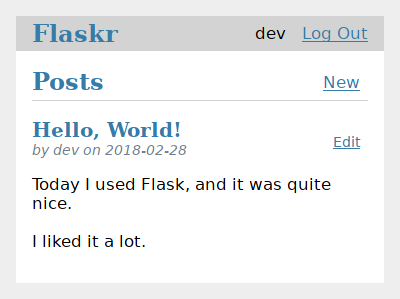

# Flask上手

## 参考资料

https://flask.palletsprojects.com/en/2.2.x/installation/

Flow下面的教程，一步一步前进

https://flask.palletsprojects.com/en/2.2.x/tutorial/

做一个blog web：



## Step by Step

### Step 0：Backgroud

build a basic blog application called Flaskr using Flask.


### Step 1: Project Layout

#### Create a project directory

```shell
mkdir flask-tutorial
cd flask-tutorial/
```


#### Install Flask

[Flask Installation Doc ](https://flask.palletsprojects.com/en/2.2.x/installation/)

Create an python environment using [venv](https://docs.python.org/3/library/venv.html#module-venv):

```shell
$ python3 -m venv venv

$ tree . -L 3
.
└── venv
    ├── bin
    │   ├── Activate.ps1
    │   ├── activate
    │   ├── activate.csh
    │   ├── activate.fish
    │   ├── pip
    │   ├── pip3
    │   ├── pip3.9
    │   ├── python -> python3
    │   ├── python3 -> /Users/yangls06/opt/miniconda3/bin/python3
    │   └── python3.9 -> python3
    ├── include
    ├── lib
    │   └── python3.9
    └── pyvenv.cfg

5 directories, 11 files

$ tree venv/lib/python3.9/ -L 3
venv/lib/python3.9/
└── site-packages
    ├── _distutils_hack
    │   ├── __init__.py
    │   ├── __pycache__
    │   └── override.py
    ├── distutils-precedence.pth
    ├── pip
    │   ├── __init__.py
    │   ├── __main__.py
        ...
    ├── pkg_resources
    ...
```


Activate the environment

```shell
$ . venv/bin/activate
```

Then the environment has been changed.


Install Flask

Within the activated environment, install Flask using `pip`:

```shell
$ pip install Flask

Looking in indexes: https://pypi.douban.com/simple
Collecting Flask
  Downloading https://pypi.doubanio.com/packages/0f/43/15f4f9ab225b0b25352412e8daa3d0e3d135fcf5e127070c74c3632c8b4c/Flask-2.2.2-py3-none-any.whl (101 kB)
     ━━━━━━━━━━━━━━━━━━━━━━━━━━━━━━━━━━━━━━━━ 101.5/101.5 KB 1.8 MB/s eta 0:00:00
...
Collecting MarkupSafe>=2.0
  Downloading https://pypi.doubanio.com/packages/06/7f/d5e46d7464360b6ac39c5b0b604770dba937e3d7cab485d2f3298454717b/MarkupSafe-2.1.1-cp39-cp39-macosx_10_9_universal2.whl (17 kB)
Installing collected packages: zipp, MarkupSafe, itsdangerous, click, Werkzeug, Jinja2, importlib-metadata, Flask
Successfully installed Flask-2.2.2 Jinja2-3.1.2 MarkupSafe-2.1.1 Werkzeug-2.2.2 click-8.1.3 importlib-metadata-5.1.0 itsdangerous-2.1.2 zipp-3.11.0
```


Git init

```shell
$ git init
```


with `.gitignore`

```
venv/

*.pyc
__pycache__/

instance/

.pytest_cache/
.coverage
htmlcov/

dist/
build/
*.egg-info/
```


Add folders

```shell
$ tree -a -L 1
.
├── .git
├── .gitignore
├── flaskr
├── tests
└── venv

4 directories, 1 file
```


### Step 3: Application Setup


